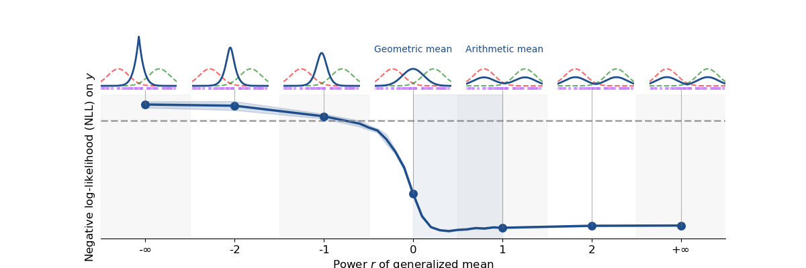

# Beyond Mixtures and Products for Ensemble Aggregation: A Likelihood Perspective on Generalized Means

**Raphaël Razafindralambo¹, Rémy Sun¹, Frédéric Precioso¹, Damien Garreau², Pierre-Alexandre Mattei¹**

¹ Université Côte d'Azur, Inria, CNRS, I3S/LJAD, Maasai, Nice, France  
² Julius-Maximilians-Universität Würzburg, Institute for Computer Science / CAIDAS, Würzburg, Germany

[](https://arxiv.org/abs/2603.04204)

---



## Abstract

We study density aggregation in deep ensembles through the lens of normalized generalized means of order $r$. This framework unifies linear pooling (probability averaging, $r=1$) and geometric pooling (logit averaging, $r=0$). We show that $r \in [0, 1]$ is the only range guaranteeing systematic improvements over individual models, providing a principled justification for these two standard aggregation rules. We validate our theoretical findings empirically on image and text classification benchmarks.

---

## Code

Training scripts for deep ensembles across three datasets: CIFAR-100, IMDB, and MedMNIST.

## Requirements

```bash
pip install lightning torch torchvision torch-uncertainty medmnist pandas tqdm numpy
```

## Datasets

| Dataset  | Task                      | Model          |
|----------|---------------------------|----------------|
| CIFAR-100 | Image classification (100 classes) | WideResNet28x10 |
| IMDB     | Sentiment analysis (binary) | Transformer    |
| MedMNIST | Medical image classification | ResNet18       |

Data is expected in `./data/`:
- CIFAR-100: downloaded automatically
- IMDB: `./data/IMDB Dataset.csv`
- MedMNIST: downloaded automatically with `--download`

## Usage

### CIFAR-100

```bash
python train_cifar100_script.py \
    --seed 1 \
    --batch_size 256 \
    --max_epochs 200 \
    --num_estimators 10 \
    --no_fast_dev_run
```

| Argument           | Default | Description                          |
|--------------------|---------|--------------------------------------|
| `--seed`           | 42      | Random seed                          |
| `--batch_size`     | 128     | Batch size                           |
| `--max_epochs`     | 200     | Number of training epochs            |
| `--num_estimators` | 5       | Number of models in the ensemble     |
| `--no_fast_dev_run` | —      | Disable fast dev run (full training) |

Logs are saved with TensorBoard under `logs/`.

---

### IMDB

```bash
python train_imdb_script.py \
    --seed 1 \
    --batch_size 32 \
    --save_dir logs/transformers/seed_1
```

| Argument       | Default                        | Description              |
|----------------|--------------------------------|--------------------------|
| `--seed`       | 0                              | Random seed              |
| `--batch_size` | 32                             | Batch size               |
| `--epochs`     | 20                             | Number of training epochs |
| `--save_dir`   | `deep_ensemble_tu/logs/transformers` | Output directory    |

---

### MedMNIST

```bash
python train_medmnist_script.py \
    --seed 1 \
    --save_dir logs/resnet18/seed_1 \
    --do_test \
    --download
```

| Argument       | Default       | Description                              |
|----------------|---------------|------------------------------------------|
| `--seed`       | 0             | Random seed                              |
| `--data_flag`  | `dermamnist`  | MedMNIST dataset name                    |
| `--save_dir`   | `runs/dermamnist` | Output directory                     |
| `--epochs`     | 100           | Number of training epochs                |
| `--batch_size` | 32            | Batch size                               |
| `--lr`         | 1e-3          | Learning rate                            |
| `--size`       | 28            | Image size                               |
| `--download`   | —             | Download the dataset if not present      |
| `--do_test`    | —             | Run evaluation on test set after training |

## Configuration

Global defaults for CIFAR-100 are in [config_de.py](config_de.py) (learning rate, scheduler milestones, augmentation policy, etc.).

## Citation

```bibtex
@article{razafindralambo2026beyond,
  title={Beyond Mixtures and Products for Ensemble Aggregation: A Likelihood Perspective on Generalized Means},
  author={Razafindralambo, Rapha{\"e}l and Sun, R{\'e}my and Precioso, Fr{\'e}d{\'e}ric and Garreau, Damien and Mattei, Pierre-Alexandre},
  journal={42nd Conference on Uncertainty in Artificial Intelligence (UAI 2026)},
  year={2026}
}
```
